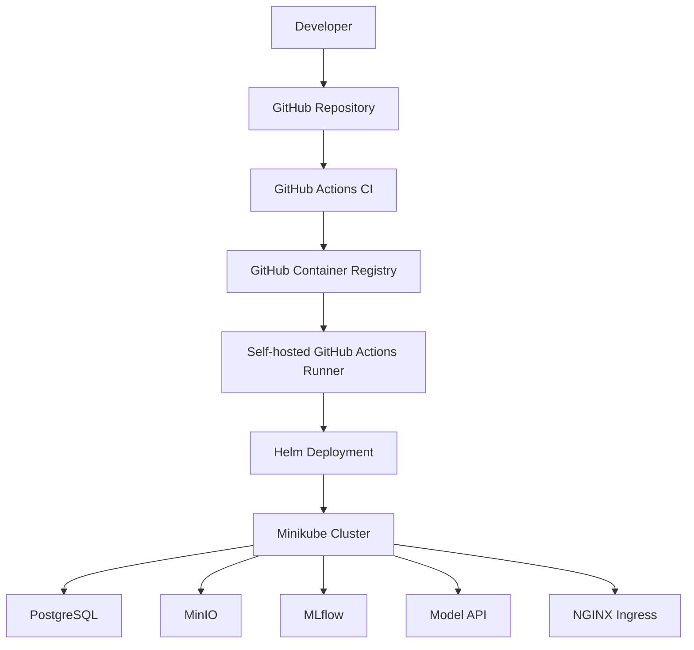
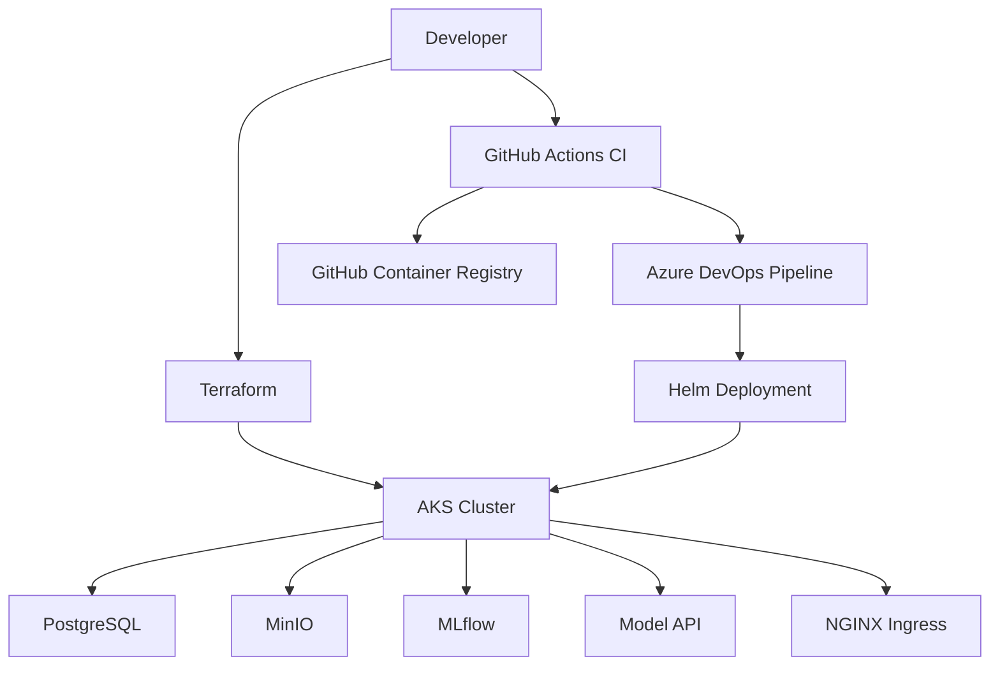
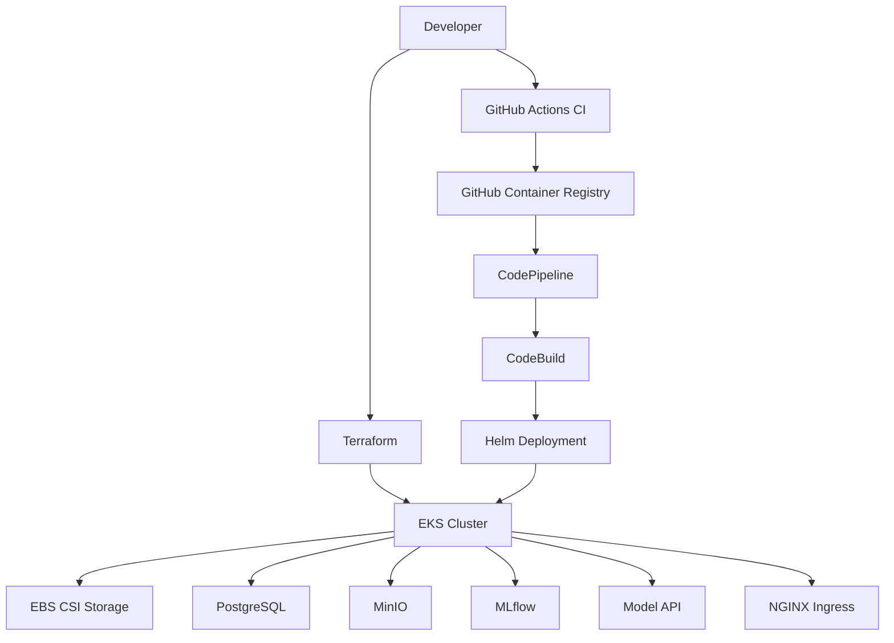

# AIDP Platform Architecture

## Overview

AIDP (AI Deployment Platform) is a hands-on cloud-native platform engineering project designed to demonstrate a complete ML application lifecycle across Kubernetes environments.

The platform evolved through three major stages:

1. **Stage 1 — Local platform engineering**
2. **Stage 2 — Azure AKS deployment**
3. **Stage 3 — AWS EKS deployment**

Across these stages, the same core platform stack was progressively packaged, automated, and deployed using different infrastructure and CI/CD models.

---

## Architecture Evolution Across Three Stages

The project did not begin as a fixed final-state architecture. It evolved in layers:

- **Local stage** → validate platform behavior with Minikube and Helm
- **Azure stage** → move the same deployment model to managed Kubernetes on AKS
- **AWS stage** → extend the same platform to EKS and introduce AWS-native deployment orchestration

This progression is important because it reflects a real engineering workflow: stabilize locally, standardize with Helm, then extend into managed cloud environments.

---

## Stage 1 — Local Platform Architecture

In the first stage, the goal was to build and validate the entire platform locally using Minikube, Helm, GitHub Actions CI, and a self-hosted runner for CD.

### Stage 1 Characteristics

- Local Kubernetes runtime with **Minikube**
- Application deployment via **Helm**
- CI handled by **GitHub Actions**
- CD handled by a **self-hosted runner**
- Fast debugging and low-cost experimentation

This stage established the reusable platform model before moving to managed cloud services.

---

## Stage 2 — Azure AKS Architecture

In the second stage, the local deployment model was extended to Azure using AKS and Terraform. CI remained centralized in GitHub Actions, while CD shifted to Azure DevOps.

### Stage 2 Characteristics

- Infrastructure provisioned using **Terraform**
- Managed Kubernetes runtime on **AKS**
- CI remained in **GitHub Actions**
- CD moved to **Azure DevOps**
- Same Helm chart reused with Azure-specific values

This stage introduced cloud-managed Kubernetes operations while preserving the same application deployment model.

---

## Stage 3 — AWS EKS Architecture

In the third stage, the platform was extended to AWS using EKS. Terraform provisioned the cluster and networking, while CD moved to an AWS-native model with CodePipeline and CodeBuild.

### Stage 3 Characteristics

- Infrastructure provisioned using **Terraform**
- Managed Kubernetes runtime on **EKS**
- Storage integrated through **EBS CSI**
- CI remained centralized in **GitHub Actions**
- CD shifted to **AWS CodePipeline + CodeBuild**
- Same Helm chart reused with AWS-specific values

This stage completed the multi-cloud evolution of the project.

---

## Shared Platform Components

Across all stages, the same logical application stack was preserved.

### PostgreSQL
Used as the backend metadata store for MLflow.

### MinIO
Used as S3-compatible artifact storage for models and experiment outputs.

### MLflow
Used for experiment tracking, artifact management, and model registry functions.

### Model API
Used as the containerized inference service that exposes prediction endpoints.

### NGINX Ingress
Used to route external HTTP traffic to platform services such as the Model API and MLflow.

---

## Shared Deployment Model

Although the infrastructure and CD mechanism changed by stage, the application deployment model remained consistent.

- Kubernetes manifests were standardized through **Helm**
- Environment-specific settings were handled through **values files**
- CI continued to build and publish container images to **GHCR**
- The same platform stack was reused across local, Azure, and AWS stages

This consistency is one of the core strengths of the project.

---

## Key Design Principles

### Build once, deploy everywhere
The application image is built once in CI and reused across environments.

### Separation of CI and CD
Artifact creation and deployment execution are separated by design.

### Helm-based standardization
The same platform stack is deployed through a reusable Helm chart.

### Progressive infrastructure evolution
The project moves from local validation to managed Kubernetes and finally to multi-cloud architecture.

### Cloud-aware portability
Kubernetes remains the runtime standard, while cloud-native integrations differ per platform.

---

## Summary

AIDP is not just a Kubernetes deployment exercise. It is a staged platform engineering project that demonstrates how a containerized ML platform can evolve from:

**local Kubernetes**  
→ **Azure AKS**  
→ **AWS EKS**

while preserving a consistent deployment model, reusable packaging approach, and increasingly mature CI/CD architecture.
