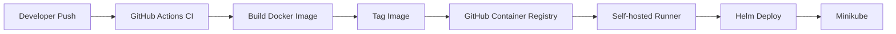
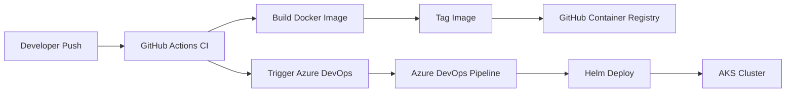

# AIDP CI/CD Diagrams

This document separates the CI/CD flow by project stage, because the CI artifact strategy remained consistent while the CD execution path changed across Local, AKS, and EKS deployments.

---

## Stage 1 — Local CI/CD

In the local stage, CI was handled by GitHub Actions and CD was executed through a self-hosted GitHub Actions runner that had direct access to the local Kubernetes environment.

### Characteristics

- CI and CD both started from GitHub
- CD relied on a self-hosted runner
- Image was pulled from GHCR and loaded into Minikube
- Helm performed deployment and upgrades locally

---

## Stage 2 — AKS CI/CD

In the Azure stage, GitHub Actions remained the centralized CI engine, but deployment moved to Azure DevOps. GitHub Actions triggered the Azure DevOps pipeline after a successful build.

### Characteristics

- GitHub Actions continued to own CI
- Azure DevOps became the CD engine for AKS
- The image tag produced in CI was passed into the Azure deployment flow
- Helm remained the deployment mechanism

---

## Stage 3 — EKS CI/CD

In the AWS stage, GitHub Actions still produced the image artifact, but CD moved into AWS-native services. CodePipeline orchestrated the deployment and CodeBuild executed the Helm-based deployment into EKS.

### Characteristics

- CI stayed centralized in GitHub Actions
- AWS-native deployment orchestration was introduced
- CodePipeline handled the deployment flow
- CodeBuild executed `aws eks update-kubeconfig` and `helm upgrade --install`
- Helm remained the common deployment interface

---

## CI/CD Evolution Summary

Across all three stages:

- **CI remained centralized** in GitHub Actions
- **GHCR remained the shared image registry**
- **Helm remained the application deployment mechanism**
- **CD changed by environment**:
  - Local → self-hosted runner
  - AKS → Azure DevOps
  - EKS → CodePipeline + CodeBuild

This reflects the project's core delivery principle:

**Build once, deploy everywhere.**
