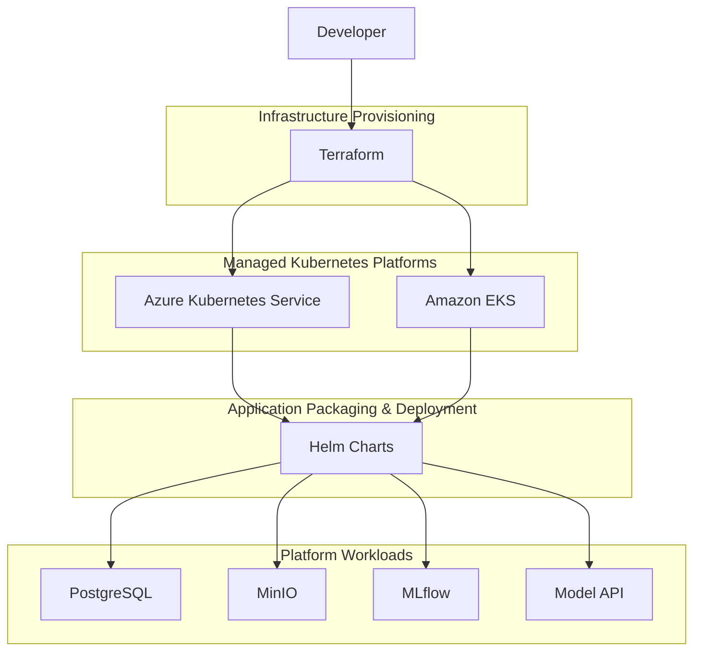

# AIDP Infrastructure Layers

This diagram shows the layered structure of the project from provisioning to runtime workloads.

## Layer Explanation

### Infrastructure Provisioning
Terraform provisions the cloud infrastructure required for managed Kubernetes environments.

### Managed Kubernetes Platforms
AKS and EKS provide the runtime platforms for the cloud stages of the project.

### Application Packaging & Deployment
Helm provides the reusable packaging and deployment model for the platform services.

### Platform Workloads
The final deployed runtime stack consists of:

- PostgreSQL
- MinIO
- MLflow
- Model API

## Why this diagram matters

This layer view explains the project as a clean engineering stack:

**Terraform**  
→ creates infrastructure

**AKS / EKS**  
→ provide Kubernetes runtime

**Helm**  
→ deploys platform services

**Workloads**  
→ deliver the application platform itself

This is one of the clearest ways to explain the project in interviews because it separates infrastructure, platform, and application concerns.
