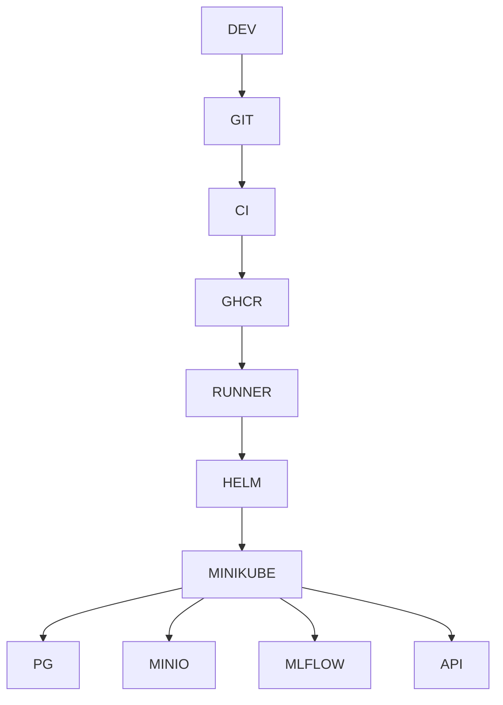
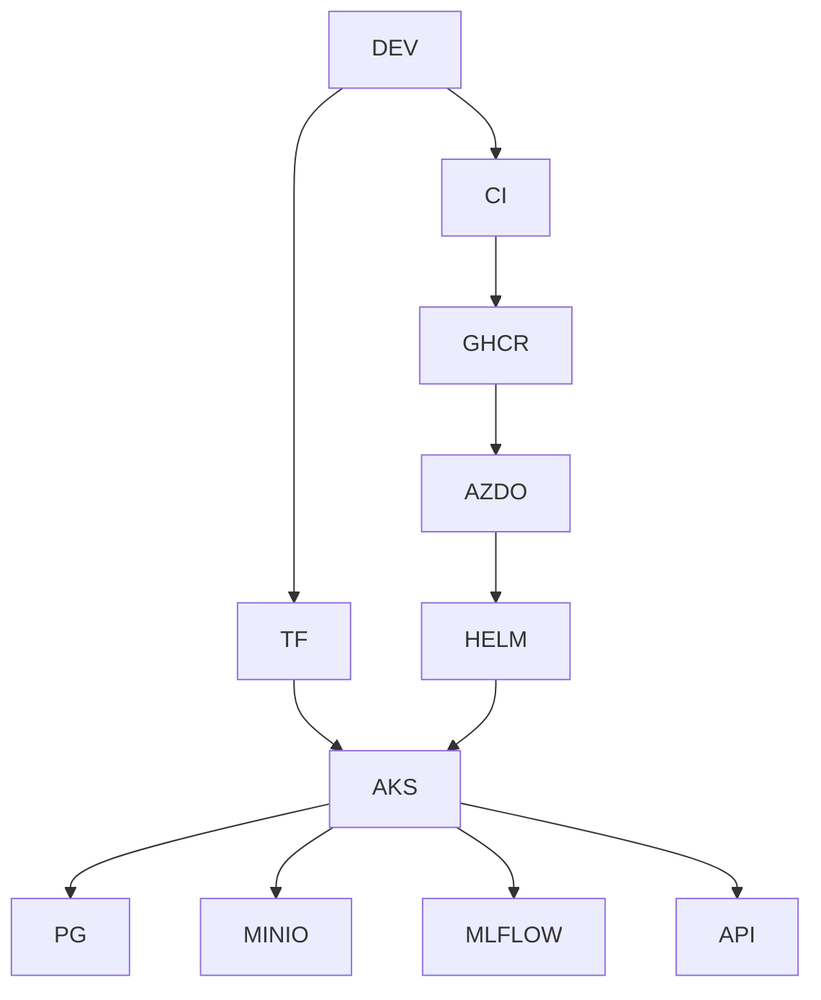
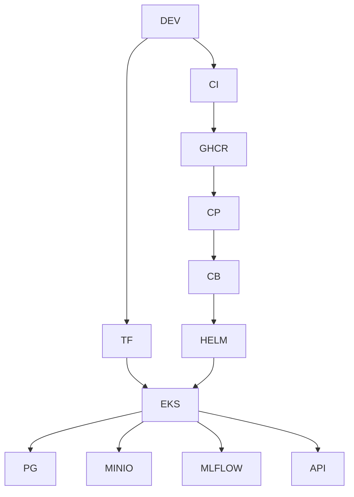

# AIDP Platform Architecture

## Overview

AIDP evolves across three stages:
1. Local (Minikube)
2. Azure AKS
3. AWS EKS

---

## Stage 1 — Local Platform Architecture

---

## Stage 2 — Azure AKS Architecture

---

## Stage 3 — AWS EKS Architecture

