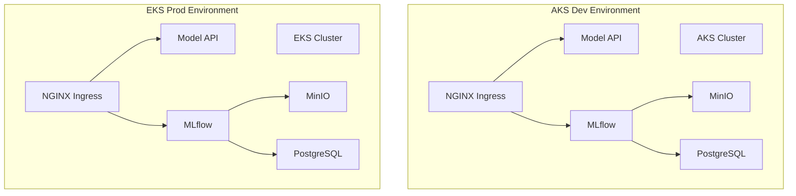

# AIDP Multi-Environment Architecture

This diagram represents the cloud-stage target view of the project, where the same platform stack is deployed across two different managed Kubernetes environments.

- **AKS** is treated as the development environment
- **EKS** is treated as the production environment

The diagram focuses on the application and environment layout, not on every possible cloud networking implementation detail.

## Interpretation

Both cloud environments run the same logical platform stack:

- **Ingress** routes external traffic
- **Model API** serves predictions
- **MLflow** handles experiment tracking and model lifecycle functions
- **MinIO** stores artifacts
- **PostgreSQL** stores metadata

The purpose of this diagram is to show environment parity across cloud platforms, while still preserving distinct deployment paths and infrastructure provisioning models.

## Why there are no explicit cloud load balancers here

This diagram intentionally does **not** place Azure Load Balancer or AWS ELB at the center of the architecture view.

That is because the real architectural focus of the project is:

- consistent platform stack
- reusable Helm deployment
- environment-specific CI/CD and infrastructure
- managed Kubernetes portability

Cloud-native ingress exposure can exist underneath this model, but it is not the clearest primary story for this diagram.
